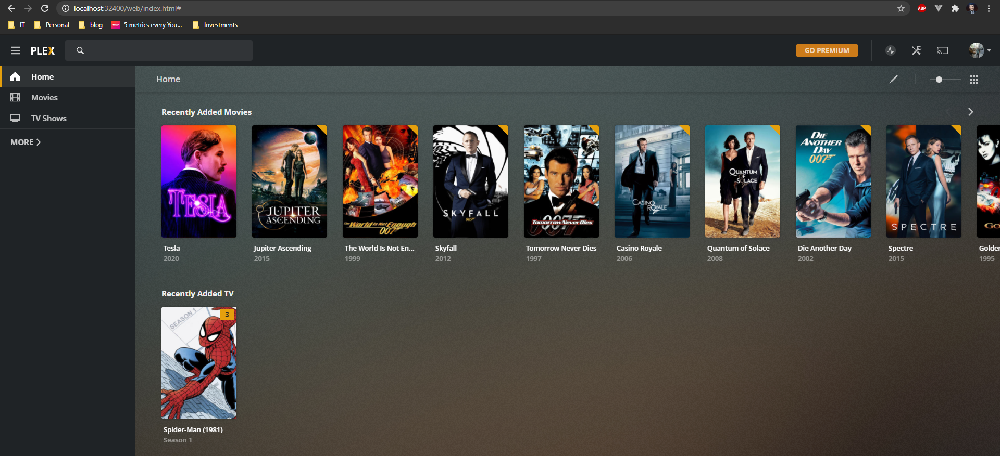

# Plex

Plex is a home media server that allows mounting movies/tvshows and then serving them on any device in the home network (or even outside).

## Getting Started

```
docker_compose up
```

**When starting for the first time and using the `bridge` network mode instead of the recommended `host`, visit https://plex.tv/claim and use
the claim in the `docker-compose` setup, as environment variable.**

#### Settings

|variable|purpose|
|---|---|
|MOVIES_DIR|path to the directory to mount with your movies|
|TVSHOWS_DIR|path to the directory to mount with your TV shows|
|PLEX_CLAIM|used once on initial setup to pair with plex servers, when `network_mode` is not `host`|

## Notes
* The recommended approach is to use `network_mode: host`, however it doesn't work on Docker for Windows and also doesn't allow for port re-mapping.

## Outcome
